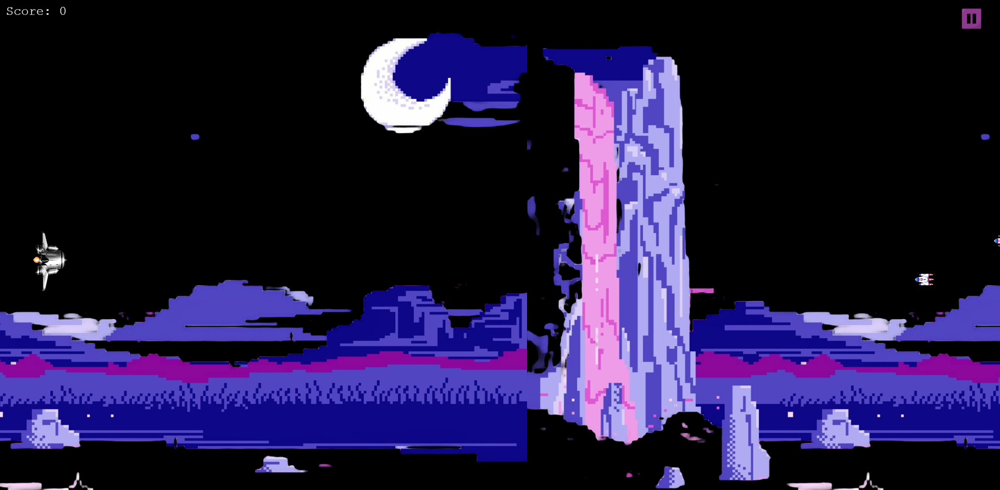
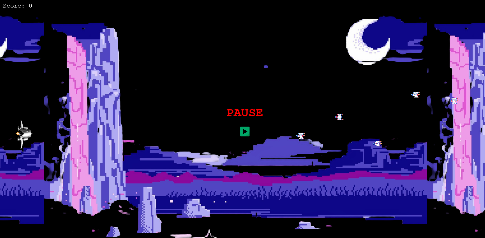
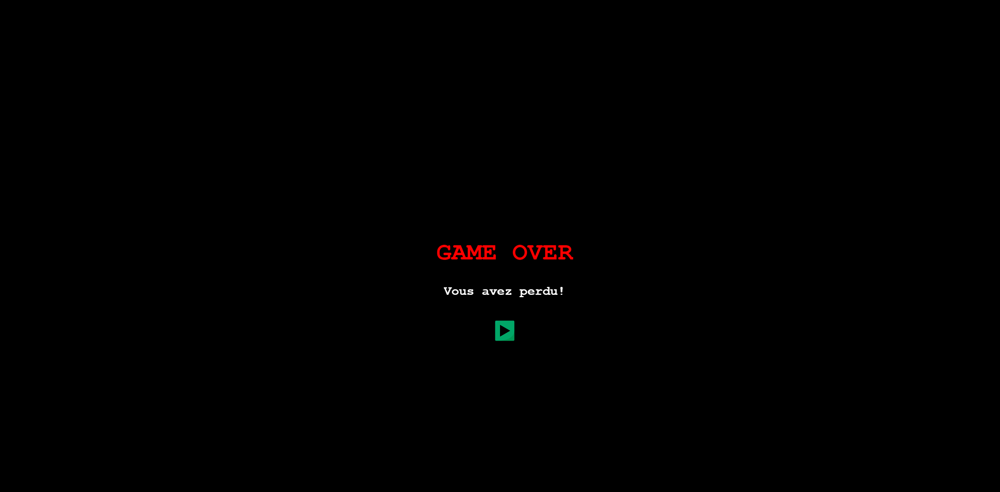

# Galactic Fleet 🚀

A fun space-themed game developed using Phaser.js, where you control a spaceship, shoot missiles, and avoid enemies. The game includes a pause feature, background music, and score tracking!

## Features ✨

- Spaceship Movement: Move your spaceship with arrow keys.
- Missile Shooting: Press the spacebar to shoot missiles and destroy enemies.
- Enemies: Randomly spawning enemies that move across the screen.
- Pause/Play: Pause the game by clicking the pause button and resume by clicking the play button. 🎮
- Game Over: Game ends when the score is too low. 😱
- Background Music: Music plays continuously in the background. 🎶

## Screenshots

## How to Play 🎮

- Move the spaceship: Use the arrow keys (up, down, left, right) to navigate.
- Shoot missiles: Press the spacebar to fire missiles at enemies.
- Pause/Play: Click the pause button to pause the game, and click the play button to resume. ⏸️➡️
- Game Over: Try to maintain a positive score! When the score goes below 0, it's game over. 😢

## Technologies Used 🛠️

- Phaser.js: A powerful HTML5 game framework.
- JavaScript: Core logic for game development.
- HTML/CSS: For the game layout and styling.

## Credits 🙌

- Assets: Game assets like images and sounds are sourced from various free online resources.
- Phaser.js: Huge thanks to the Phaser.js community for providing this amazing game framework!

## License 📜

[MIT](https://choosealicense.com/licenses/mit/)

